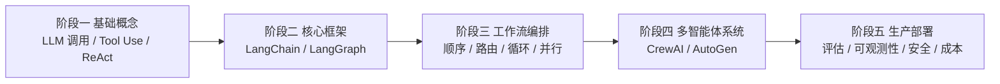

# Agent Setup

一个面向个人学习与练习的 AI Agent 工程模板，目标是把 Agent 学习路线、环境配置、依赖安装、示例练习和辅助教学提示词整理到同一个仓库里，做到 clone 下来后可以直接开始学、直接开始跑。

这个仓库不是生产级 Agent 平台，而是一个用于学习、搭建、实验和理解 Agent 工作流的练习项目。

## 这个仓库包含什么

- 渐进式练习：从 LangChain 基础到 LangGraph、CrewAI、AutoGen，再到综合编排
- 环境配置说明：虚拟环境、依赖安装、Windows 稳定安装方案
- 快速启动脚本：自动创建 .venv、安装依赖、生成 .env
- Gemini 辅导设定：可直接复制到网页上的 Gemini 用于陪练学习
- 清晰的项目结构：方便自己维护，也方便别人 fork 和复用

## 适合谁

- 想系统学习 Agent 的开发者
- 想从单 Agent 过渡到工作流编排和多智能体协作的学习者
- 想要一个可直接修改、直接试验的本地练习仓库的人

## 学习路线图



路线图说明：
- 阶段一先建立 Agent 的最小心智模型
- 阶段二开始接触实际框架和状态编排
- 阶段三是整个学习的核心，重点理解 Agent workflow orchestration
- 阶段四扩展到多智能体协作
- 阶段五再关注评估、部署和可维护性

## 快速开始

### 方式一：推荐，直接使用脚本初始化

Windows PowerShell：

```powershell
git clone https://github.com/Shizue123/agent-setup.git
cd agent-setup
.\scripts\setup.ps1
```

脚本会自动完成这些动作：
- 创建 .venv 虚拟环境
- 升级 pip / setuptools / wheel
- 安装 [exercises/requirements.txt](exercises/requirements.txt)
- 如果不存在 [exercises/.env](exercises/.env)，则由 [exercises/.env.example](exercises/.env.example) 自动复制生成

执行完后，你只需要补充 API Key，然后开始运行练习。

### 方式二：手动初始化

```powershell
git clone https://github.com/Shizue123/agent-setup.git
cd agent-setup
python -m venv .venv
.\.venv\Scripts\Activate.ps1
python -m pip install --upgrade pip setuptools wheel
python -m pip install -r exercises/requirements.txt
Copy-Item exercises/.env.example exercises/.env
```

### 第一次运行建议

```powershell
.\.venv\Scripts\python.exe exercises/01-langchain-basics/01_hello_agent.py
```

## Windows 稳定安装方案

如果你在 Windows 下安装依赖时遇到以下问题：
- 下载超时
- SSL 波动
- `WinError 32` 临时文件被占用
- 大体积 wheel 安装中断

建议使用下面这套更稳的方式：

```powershell
New-Item -ItemType Directory -Force .pip-tmp, .pip-cache
$env:TMP = "$PWD\.pip-tmp"
$env:TEMP = "$PWD\.pip-tmp"
$env:PIP_CACHE_DIR = "$PWD\.pip-cache"
.\.venv\Scripts\python.exe -m pip install --upgrade pip setuptools wheel
.\.venv\Scripts\python.exe -m pip install -r exercises/requirements.txt --retries 10 --timeout 120 --disable-pip-version-check
```

安装后建议验证：

```powershell
.\.venv\Scripts\python.exe -m pip check
.\.venv\Scripts\python.exe -c "import chromadb, langgraph, crewai_tools, autogen_ext; print('imports-ok')"
```

如果输出 `imports-ok`，说明关键依赖可正常导入。

## VS Code 使用建议

clone 后建议先在 VS Code 中切换解释器到：

```text
d:\agent-setup\.venv\Scripts\python.exe
```

否则即使依赖已经安装完成，Pylance 仍可能提示导入无法解析。

## 环境变量

项目默认使用：

- [exercises/.env.example](exercises/.env.example) 作为模板
- [exercises/.env](exercises/.env) 作为本地实际配置

常见变量包括：
- `OPENAI_API_KEY`
- `ANTHROPIC_API_KEY`
- `GOOGLE_API_KEY`
- `SERPER_API_KEY`
- `TAVILY_API_KEY`

注意：
- `.env` 已加入忽略规则，不会被提交
- 公共仓库里只保留 `.env.example`

## 项目结构

```text
agent-setup/
├── .gitignore
├── LICENSE
├── README.md
├── gemini-tutor-prompt.md
├── exercises/
│   ├── .env.example
│   ├── requirements.txt
│   ├── 01-langchain-basics/
│   │   └── 01_hello_agent.py
│   ├── 02-langgraph-workflow/
│   │   └── 01_simple_graph.py
│   ├── 03-crewai-multiagent/
│   │   └── 01_research_crew.py
│   ├── 04-autogen-agents/
│   │   └── 01_multi_agent_chat.py
│   └── 05-advanced-patterns/
│       └── 01_research_pipeline.py
└── scripts/
    ├── clone-reference-repos.ps1
    └── setup.ps1
```

## 练习索引

### 1. LangChain 基础
- 文件：[exercises/01-langchain-basics/01_hello_agent.py](exercises/01-langchain-basics/01_hello_agent.py)
- 内容：基础模型调用、Tool Use、ReAct Agent

### 2. LangGraph 工作流编排
- 文件：[exercises/02-langgraph-workflow/01_simple_graph.py](exercises/02-langgraph-workflow/01_simple_graph.py)
- 内容：顺序图、条件路由、循环模式

### 3. CrewAI 多智能体
- 文件：[exercises/03-crewai-multiagent/01_research_crew.py](exercises/03-crewai-multiagent/01_research_crew.py)
- 内容：Crew、Task、Flow 编排

### 4. AutoGen 多 Agent
- 文件：[exercises/04-autogen-agents/01_multi_agent_chat.py](exercises/04-autogen-agents/01_multi_agent_chat.py)
- 内容：基础 Agent、多 Agent 协作、MCP 方向

### 5. 综合高级模式
- 文件：[exercises/05-advanced-patterns/01_research_pipeline.py](exercises/05-advanced-patterns/01_research_pipeline.py)
- 内容：研究管道、状态编排、循环优化

## 可选：拉取参考仓库

这个仓库默认不包含第三方源码仓库，避免仓库体积过大，也避免把别人的 Git 历史直接混进来。

如果你想在本地一边练习一边对照官方实现，可以运行：

```powershell
.\scripts\clone-reference-repos.ps1
```

它会把这些参考仓库浅克隆到本地 `projects/` 目录：
- `langchain-ai/langgraph`
- `crewAIInc/crewAI-examples`
- `langchain-ai/deepagents`

这些参考仓库仅用于本地学习，不参与本仓库版本管理。

## Gemini 学习辅导

如果你希望在网页上的 Gemini 里获得按阶段推进的学习辅导，可以使用：

- [gemini-tutor-prompt.md](gemini-tutor-prompt.md)

使用方式：
- 打开 Gemini 网页版
- 将文件中的设定复制到新对话或自定义 Gem 中
- 然后让它基于这个仓库的练习文件按阶段辅导你

## 推荐学习顺序

1. 阅读本 README，完成环境初始化
2. 配置 [exercises/.env](exercises/.env)
3. 从 [exercises/01-langchain-basics/01_hello_agent.py](exercises/01-langchain-basics/01_hello_agent.py) 开始
4. 再进入 [exercises/02-langgraph-workflow/01_simple_graph.py](exercises/02-langgraph-workflow/01_simple_graph.py)
5. 然后学习 CrewAI、AutoGen 和高级综合练习
6. 有疑问时用 Gemini 辅导提示词或本地查官方参考仓库

## 设计原则

- 以学习路径为中心，而不是堆砌框架
- 优先保证可运行、可理解、可修改
- 文档尽量把环境和常见问题提前说清楚
- 示例代码以练习骨架为主，保留思考空间

## 许可证

本仓库采用 [MIT License](LICENSE)。

注意：如果你本地额外拉取了第三方参考仓库，它们各自遵循自己的许可证，并不自动继承本仓库的 MIT 许可。